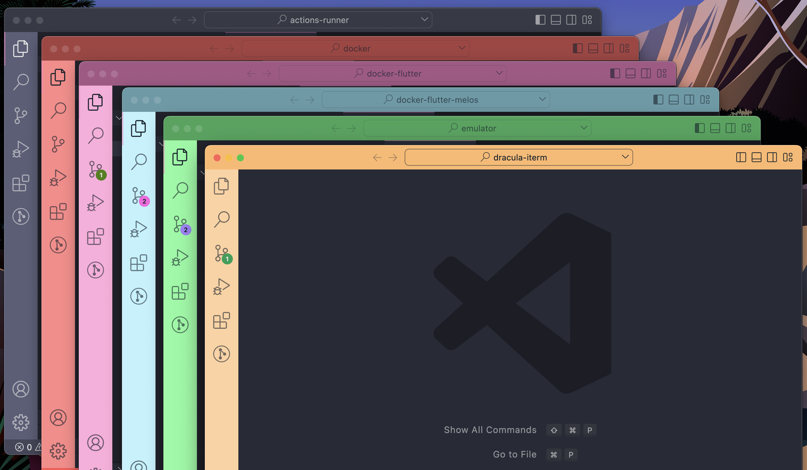

# Dracula for [Peacock extension](https://marketplace.visualstudio.com/items?itemName=johnpapa.vscode-peacock)

> A dark theme for [Peacock extension](https://marketplace.visualstudio.com/items?itemName=johnpapa.vscode-peacock)

## Install
All instructions can be found in [`INSTALL.md`](./INSTALL.md)

## Team

This theme is maintained by the following person(s) and a bunch of [awesome contributors](https://github.com/dracula/template/graphs/contributors).

 |
--- | 
[Tom Nicklin](https://github.com/shmink) | 

## Community

- [Twitter](https://twitter.com/draculatheme) - Best for getting updates about themes and new stuff.
- [GitHub](https://github.com/dracula/dracula-theme/discussions) - Best for asking questions and discussing issues.
- [Discord](https://draculatheme.com/discord-invite) - Best for hanging out with the community.

## License

[MIT License](./LICENSE)
